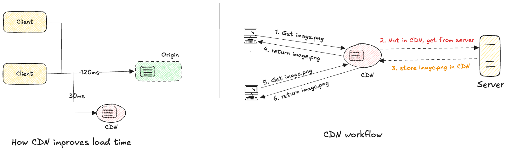

# Content Delivery Network (CDN)

- Network of geographically dispersed servers.
- Used to deliver static content like `images, videos, CSS, JS files` etc.

## CDN workflow

1. Client 1, tries to get image using URL (`provided by CDN provider`)
2. If the CDN server does not have it, it requests image from web server (e.g. `Amazon S3`).
3. The origin return the image with optional HTTP header `Time-To-Live (TTL)` describing how long to cache the image.
4. CDN caches the image, return to Client 1.
5. Client 2 requests the same image.
6. The image is returned from CDN as long the TTL has not expired.

   

## Consideration of Using CDNs

- **Cost**:
  - Run by 3rd party providers, charging for data transfers in and out
  - Caching infrequent assets provide no significant benefit
  - Consider removing them from CDN

- **Setting Appropriate Cache Expiry**:
  - For time-sensitive content, setting cache expiry time is crucial.
  - Should be neither too long nor too short.
  - If too long: stale content
  - If too short: repeated reloading from origin servers.

- **CDN Fallback**
  - Considering how the app copes with CDN failure
  - In case of CDN temporary outage, clients should detect and request resources from origin.

- **Invalidating Files**
  - Removing files from CDN before expiry:
    - Invalidate CDN object using vendor API.
    - Use object versioning by adding a parameter to URL (`e.g. image.png?v=2.0.2`)
