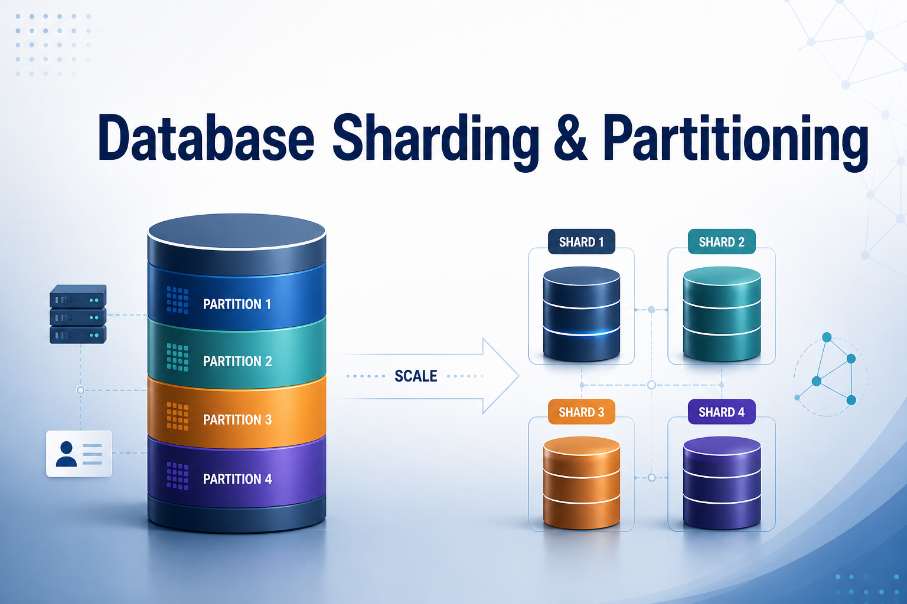

# Database scaling:

Techniques to boost capacity and performance, handling growing data and traffic while delivering consistent reliability. A scalable database architecture lets you grow without constant overhauls. Sharding & Partitioning are the cornerstones of that scalability. 🔁

## 🧱 Sharding & Partitioning: The Cornerstones

🔸 Partitioning – logical split of a table within a single database (by rows or columns).  
🔸 Sharding – horizontal partitions spread across independent database nodes, each with its own compute and storage.

### 🚀 Why Shard?

- Write throughput exceeds a single instance’s limits
- Data volume breaks backup/restore windows
- You need to colocate data with users (geo‑distribution)

### ⚙️ Three Common Strategies

1️⃣ Hash/Key‑based – even data distribution, but range queries force scatter‑gather; resharding is painful (consistent hashing helps).

2️⃣ Range‑based – efficient sequential scans, but hotspots can appear on the latest shard.

3️⃣ Directory‑based – a lookup service maps key → shard. Enables dynamic rebalancing, but adds an extra hop and a critical dependency.

### 🧩 Major Trade‑Offs You’ll Face

🔹 Joins & Transactions – cross‑shard joins are impossible directly; transactions require 2PC and add latency. Denormalization or eventual consistency often wins.

🔹 Shard Key Selection – high cardinality + query‑pattern alignment are crucial. A bad key creates lopsided hot shards.

🔹 Rebalancing – adding/removing shards demands live data migration while keeping availability. Logical shards (vnodes, virtual buckets) simplify this.

🔹 Operational Overhead – more nodes = more monitoring, backup, and failover complexity. The app layer must handle routing and scatter‑gather logic.

### 🌍 Real‑World Pattern

Combine sharding for write scaling with per‑shard replication for read scaling. This is the blueprint behind Vitess, CockroachDB, and Spanner.

### ⚠️ When NOT to Shard

If vertical scaling, indexing, caching, and read replicas suffice, avoid turning your DB into a full‑blown distributed system. Sharding converts your data layer into a distributed system—consensus, partition tolerance, and clock skew become your problems.

## Resource:

I've found an excellent writeup worth reading. He has a full series on scaling distributed systems:

[For further info](https://dchobarkar.github.io/2024/04/19/best-practices-for-database-sharding-and-partitioning.html)
