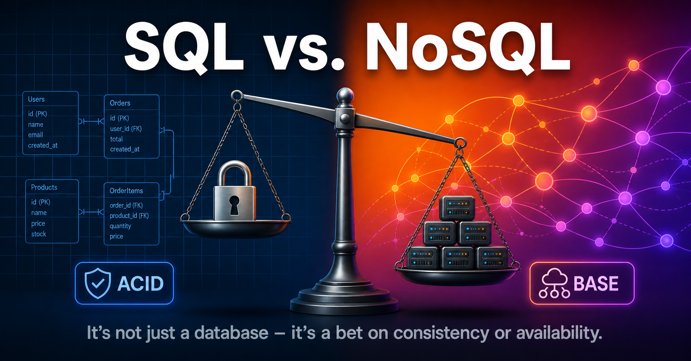

# Database Design & Trade‑offs

While scaling an application when the userbase grows larger, separation of App traffic (web/mobile tier) and database (data tier) allows them to scale independently. We can choose between a traditional relational database and a non-relational databases.

## SQL vs. NoSQL

When faced with the decision we're not just picking a database; we're making a bet on consistency vs. availability, and that's governed by CAP theorem.

### Definitions

**Relational Database (RDBMS)**:

- Most popular: MySQL, PostgreSQL, ORacle database.
- Represents store data in tables and rows.
- JOIN across DB tables using SQL.

**Non=relational Databases (NoSQL)**

- Most popular: CouchDB, Neo4j, Cassandra, HBase, DynamoDB etc.
- Four categories: `key-value stores`, `graph stores`, `column stores` and `document stores`.
- JOINs are generally not supported.

### The Core War: ACID vs BASE

- **SQL/ACID**:
  - Ensures ACID properties (`Atomicity`, `Consistency`, `Isolation`, `Durability`).
  - Enforces strict `schemas` and `referncial integrity` at the database level.
  - Downside is performance under massive scale: `vertical scaling` has physical and financial limits.
  - E.g. Banks and inventory systems

- **NoSQL/BASE**:
  - `Basically available`, `Soft State`, `Eventual Consistency`.
  - We accept stale data states for a short moment across nodes.
  - Near-infinite horizontal scaling (adding shared servers).
  - Sacrificing immidiate consistency.

### Scaling Strategies

- **Vertical Scaling (SQL)**:
  - _"Beefing up the mainframe"_ (moving instance to a more powerful machine).
  - BUT, single point of failure in a cap.

- **Horizontal Scaling (NoSQL)**:
  - _"Add more Lego bricks."_ You spin up 10 more commodity Cassandra nodes.
  - The cluster automatically partitions (shards) the load.
  - Handle millions of writes per second.

### How to Make the Trade-off (Cheat Sheet)

- **Stick with SQL (PostgreSQL/MySQL) if**:
  - You need complex `JOINs` and ad-hoc reporting (SQL is a universal language for analytics).
  - You can't tolerate stale reads (your product is a `payments or booking system`).
  - Your growth is predictable, and vertical scaling covers you for the next 3 years.

- **Move to NoSQL (MongoDB/Cassandra) if**:
  - If your application requires `super-low latency`.
  - You have unstructured data or you do not have relational data.
  - You only need to `serialize` and `deserialize` data (JSON, XML, YAML etc.)
  - You need to store massive amount of data.
  - You need `geo-distributed` writes right now (multi-master replication is native in many NoSQL DBs).

**Expert Pro-Tip**: Don't get dogmatic. The industry is moving toward _polyglot persistence_—using the right tool for the job. We might use PostgreSQL for our company ledger and MongoDB for our product catalog, both in the same architecture. And keep an eye on NewSQL (like CockroachDB or PlanetScale), which tries to give you ACID guarantees on top of a horizontally scalable architecture.
