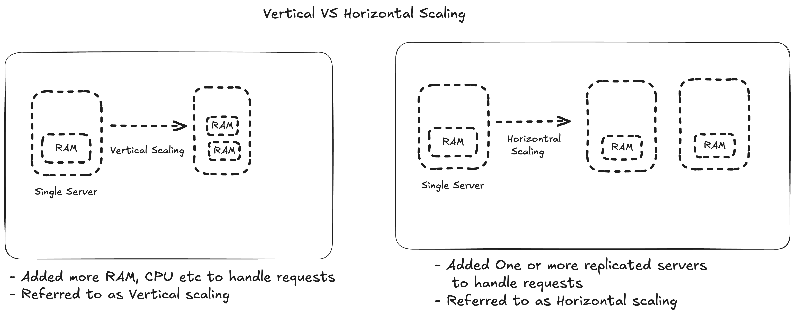
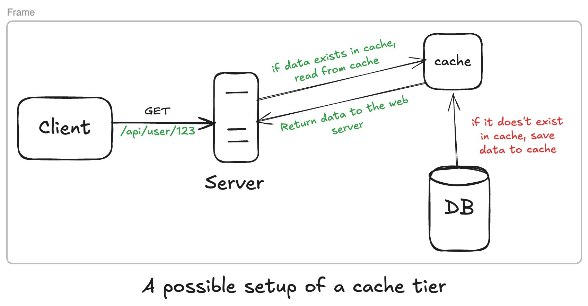

# Scalibility

## 1. Vertical Scaling VS Horizontal Scaling

### ⬆️ **Vertical Scaling**

- referred to as **"scale up"**, mean adding more power (CPU, RAM, etc.) to servers
- Particularly handy, especially because of its simplicity
- But comes with major drawbacks:
  -- Has a hard limit: impossible to add unlimited cpus, ram to a single server
  -- Does not come with failover and redundancy: one fails, system goes down

### ↔️ **Horizontal Scaling**

- referred to as **"scale-out"**, allows us to scale by adding more servers
- more desireable for large applications due to limitations of vertical scaling

---

## 2. Load Balancing

- A load balancer is a hardware appliance, a software service, or a cloud resource that distributes incoming network traffic across a group of backend servers (a “server farm”). Its job is to ensure that no single server gets overwhelmed, which improves availability, responsiveness, and scalability.

- In a horizontally scaled architecture, the load balancer is the entry point. It lets us add (or remove) server instances at will – the balancer automatically discovers them and begins distributing traffic, giving us elastic scalability.

### 2.1 Load‑Balancing Algorithms (Rules)

The algorithm is the rule that decides which backend server gets each new request. This is the core of load‑balancer configuration, and the Pareto principle applies strongly: three or four algorithms cover 80%+ of real‑world scenarios.

#### 2.1.1 Round‑Robin (and Weighted Round‑Robin)

- **How it works**: The load balancer maintains a list of servers and sends each new request to the next server in the list, cycling back to the start after the last one. **Weighted Round‑Robin** assigns a “weight” to each server based on its capacity (e.g., a server with 2× the CPU gets weight 2). The balancer then distributes requests proportionally.

- **When to use**:
  -- Stateless applications with servers of equal (or known‑different) horsepower, where requests are short‑lived and roughly uniform. Classic example: a cluster of identical web servers serving static content.
  -- You care about simplicity, low overhead, and predictability, not dynamic load awareness
  -- You already have health checks and session persistence handled separately.

- **Limitation**: Doesn’t consider current server load. If one request is unusually slow, that server may become overloaded while others sit idle.

#### 2.1.2 Least Connections (and weighted Least Connections)

- **How it works**: The balancer tracks the number of active connections to each server and sends the next request to the one with the fewest. Weighted Least‑Connections combines this with server weights.

- **When to use**: Applications with variable‑length connections (e.g., long‑polling, WebSockets, streaming). Also good when servers are not all equal.

- **Limitation**: A server with many very short connections may appear “busy” while a server with one very long connection may appear “free” – weighting helps mitigate this.

#### 2.1.3 IP‑Hash (Source‑IP Affinity)

- **How it works**: A hash function is applied to the client’s source IP address, and the result determines which server gets the request. Because the hash of a given IP always produces the same result, the same client is always routed to the same server (as long as the server pool is unchanged).

- **When to use**: When we need session persistence (sticky sessions) without storing session state in a shared cache. Also useful for stateful protocols where the server maintains per‑client context.

- **Limitation**: If a server fails, the hash space must be re‑computed, which can cause a sudden re‑distribution and overload the remaining servers.

## 3. Caching

- Keeping fast copies of data we frequently use.
- **Trade-off**: Sometimes may lead to slightly stale data but makes the app much faster.
- **Cache invalidation**: deciding when and how to update or delete the cached answer.

We need to think about three aspects:

1. **Where do we cache ?**
2. **How do we read/write data ?**
3. **How do we trade off consistency vs. latency vs. complexity ?**

---

### 3.1 Where do we cache (layers)

You can place caches at different layers:

- **Browser / CDN**

  -- Static assets (CSS, JS, images, logos) via `Cache‑Control`, `Etag`, `CDN`.

  -- Benefit: No request ever reaches our backend for static stuff.

- **Application layer cache**

  -- In‑memory store (Redis / Memcached) before the database.

  -- _Example_: User profile by `user_id`, product details by `product_id`, expensive aggregate like “top 10 trending items”.

- **Database‑level cache**

  -- Query‑caching, indexes, or in‑memory DB (e.g., Redis‑based for reads).

- **Client‑side cache (web / mobile)**

  -- Local storage, `localStorage`, `IndexedDB`, or in‑memory caches in the app.

- For horizontal scaling, we usually combine:

  -- CDN → Reverse proxy / API gateway → App → Redis cluster → DB.
  Each layer filters out the “easy” requests so the DB only sees the hard ones.

### 3.2 Common Caching patterns (How do we read/write data)

### 3.3 Caching strategies (read‑through, write‑through, write‑behind)
